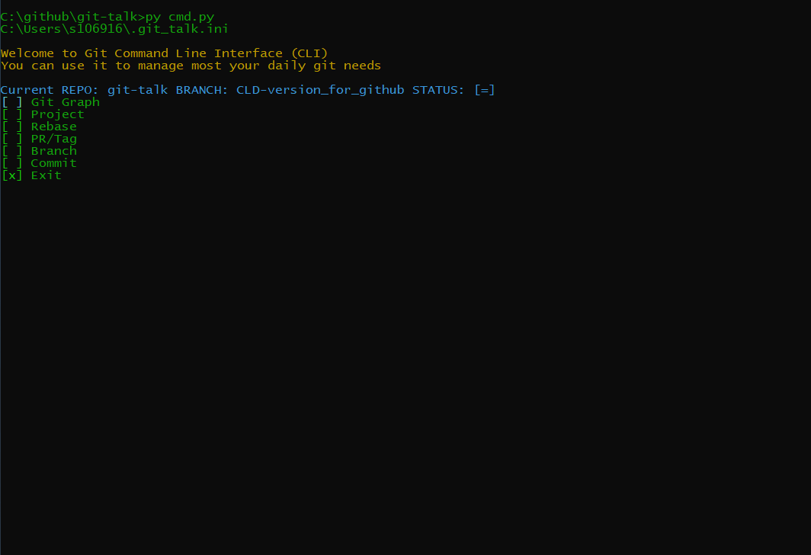
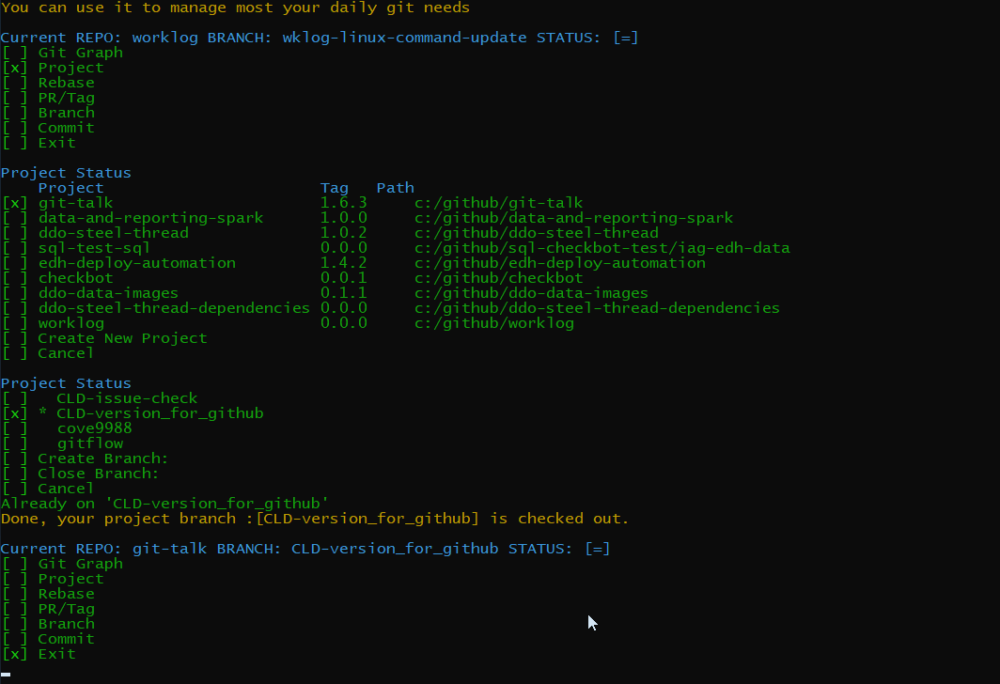
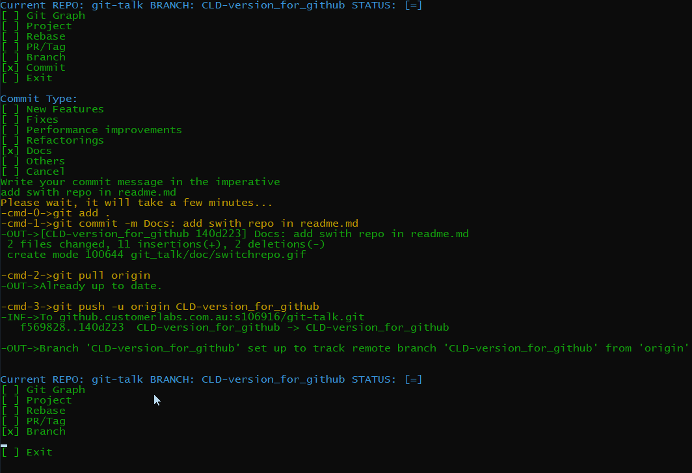
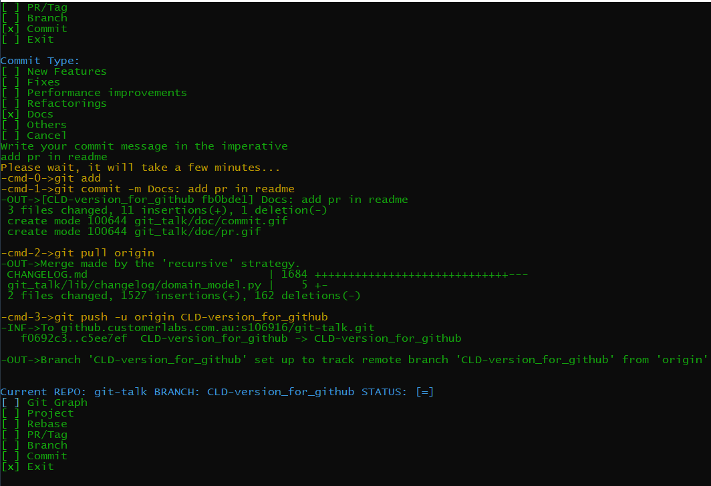
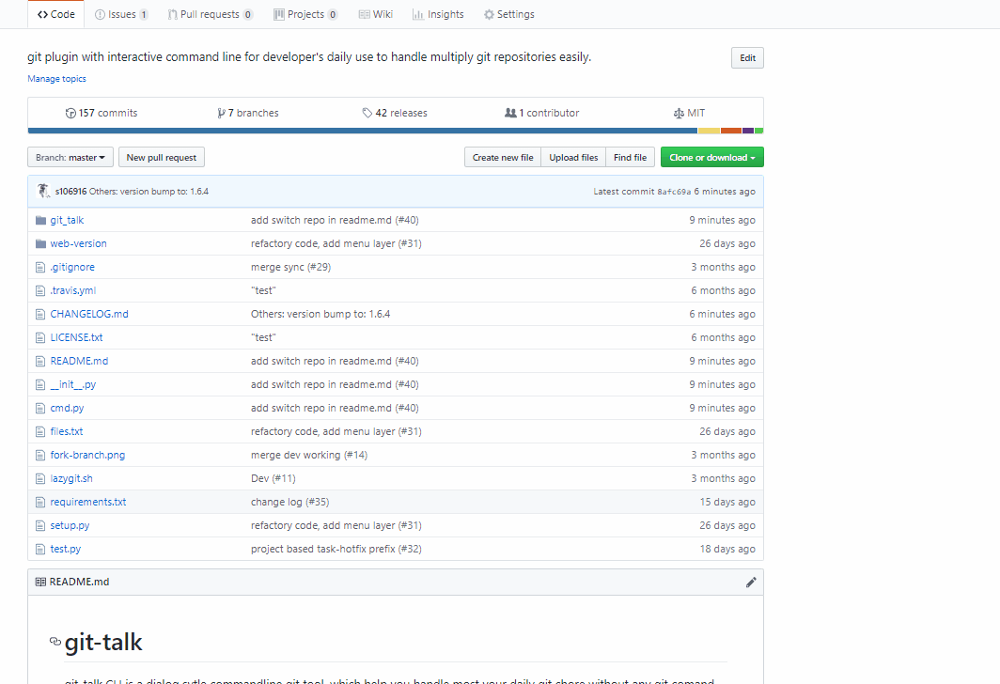
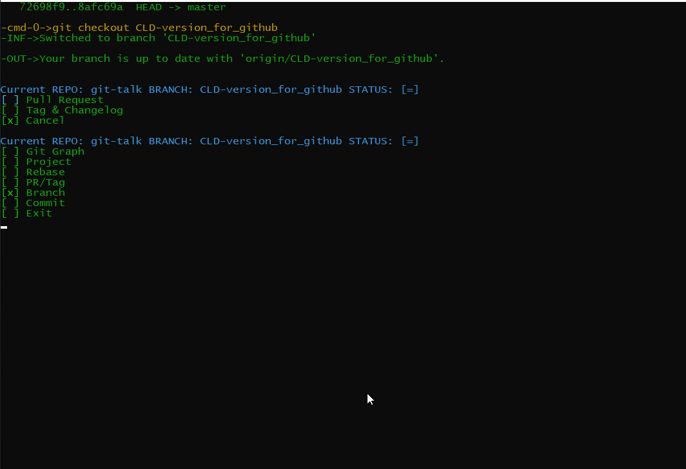
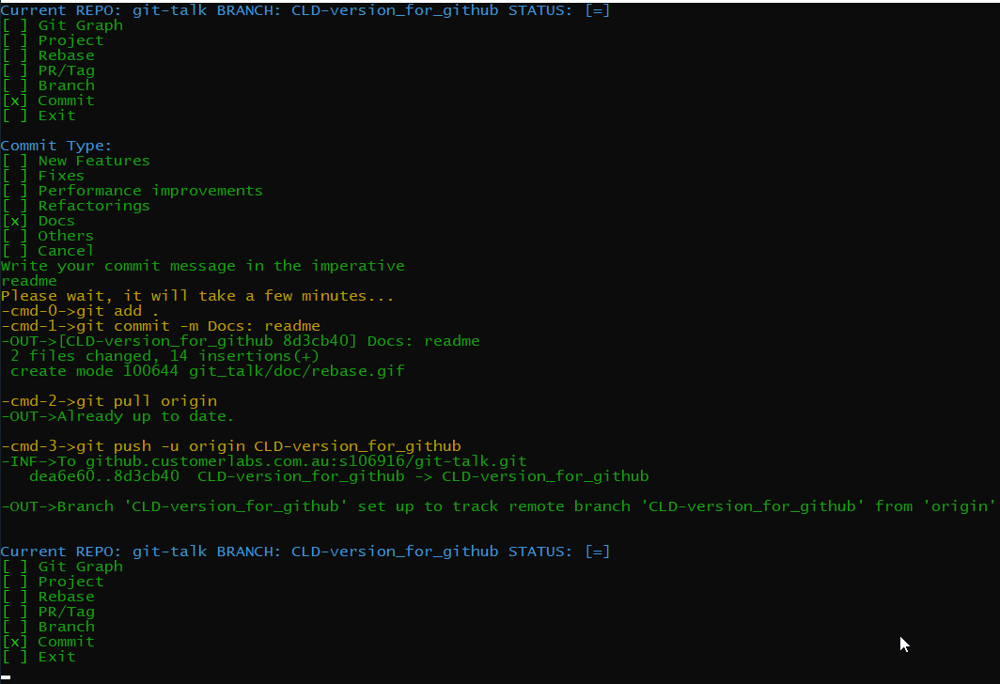
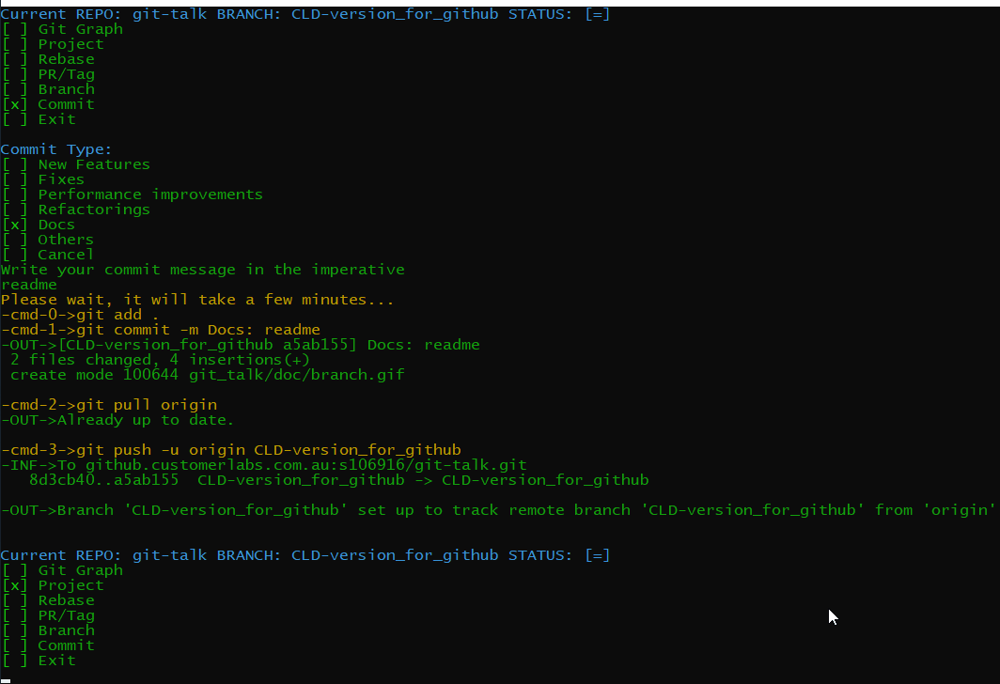

# git-talk

git-talk CLI is a dialog sytle commandline git tool, which help you to handle most your daily git chores without any git command typing.
1. It is able to manages mulitiply git reporisities in one place, reducing context switching and helping you focus on your development.
2. git-talk uses git work flow. 
        All the task branch is created from branch dev.
        Use tag based release in master with auto build change log (changelog.md)
        All commit with pre-build category: **New Features,Fixes,Performance improvements,Refactorings,Docs,Others** 
3. If you just use it for daily git, you DONOT need any git commands. If you are a git expert, you can modify the .git_talk.ini file to run you own git commands

## Installation
### Prerequesties 
[git](https://git-scm.com/download) and [Python](https://www.python.org/downloads/) >=3.5

### Installation
```
git clone https://github.customerlabs.com.au/s106916/git-talk.git
cd git-talk/
python -m pip install -r requirements.txt
python setup.py develop

###### on any terminal run #####
git-talk
```
note: you need configure git token (must) and ssh connection (optional for better security)
### How to setup ssh and token
setup [ssh](https://docs.github.com/en/github/authenticating-to-github/connecting-to-github-with-ssh)

generate github [token](https://docs.github.com/en/github/authenticating-to-github/creating-a-personal-access-token)

# Demo
## Add New Repository:
1. Have remote repo url
2. Create repo local with a few configuration
3. Work flow requires only work on task/hotfix branches, you can not commit directly to master and dev branches. 


## Swith to a different repository (project)
1. You can manage multiply repositories in one place without context switch.  
 

## Commit your changes
1. Commit changes at task branch
2. Change Type Defined.
 

## Create a PR
1. Pick a completed task branch
2. Create a PR to dev branch
 

## Create a Release Tag and Change Log
1. Once PR reviewed and merged
2. Create a release tag and the changelog will auto generated as well.

 
 

## Rebase
1. Rebase from master to dev
2. re-sync all branches from remote and local.

 

## Branch
1. switch branch, create a new task branch
2. Remove merged or unused branch from both local and remote

 

## Graph
1. display latest 20 activaties at branch level

 


## ToDoList
1. git issue create/view/assign with branch
   or JIRA API create/view/assign with branch
2. git commands in configure file
3. work flow 
4. mulitply ini files


Many Thanks to:

https://github.com/Kamik423/cutie

https://github.com/Michael-F-Bryan/auto-changelog
